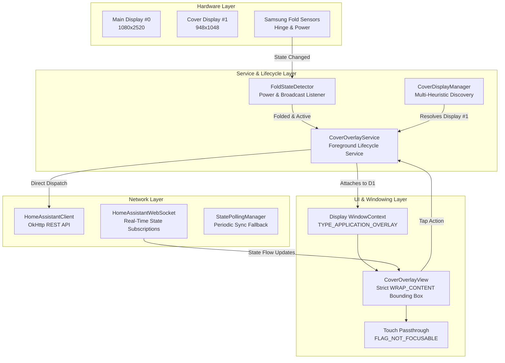
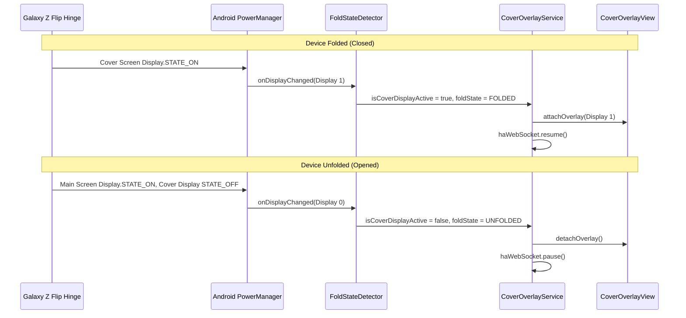

# Architecture & Technical Design

**Cover HA Overlay** is engineered specifically for foldable Android devices (Samsung Galaxy Z Flip / Fold) to provide zero-latency Home Assistant quick controls directly on the outer cover display.

---

## 1. System Overview



---

## 2. Multi-Display Window Targeting

### A. Samsung Outer Display Discovery
On Samsung One UI, standard calls to `DisplayManager.getDisplays()` without flags often omit internal secondary presentation surfaces. Cover HA Overlay queries `displayManager.getDisplays(null)` and `displayManager.getDisplays(DisplayManager.DISPLAY_CATEGORY_PRESENTATION)` and applies a multi-heuristic evaluation:
1. **Name Matching**: Checks for `"sub"`, `"cover"`, `"secondary"`, `"flip"`, `"flex"`.
2. **Aspect Ratio & Resolution Signatures**:
   - **Galaxy Z Flip7**: $948 \times 1048$ ($\approx 1.10$ aspect ratio)
   - **Galaxy Z Flip5 / Flip6**: $720 \times 748$ ($\approx 1.04$ aspect ratio)
   - **Galaxy Z Flip3 / Flip4**: $260 \times 512$ ($\approx 1.96$ aspect ratio)
3. **Strict Main Screen Immunity**: The target resolver returns `null` rather than falling back to Display #0, guaranteeing the overlay never obstructs the internal foldable display.

### B. Window Context Creation (API 31+)
```kotlin
val displayContext = context.createDisplayContext(coverDisplay)
val windowContext = displayContext.createWindowContext(
    WindowManager.LayoutParams.TYPE_APPLICATION_OVERLAY, 
    null
)
val windowManager = windowContext.getSystemService(Context.WINDOW_SERVICE) as WindowManager
```

---

## 3. Fold State & Power Lifecycle



---

## 4. Touch Passthrough & Non-Intrusive Bounding Box

Unlike full-screen overlay apps that capture the entire display touch surface:
- **`WRAP_CONTENT` Dimensions**: WindowManager bounds are strictly shrunk to the bounding rectangle of the floating pill.
- **Window Flags**:
  ```kotlin
  val flags = WindowManager.LayoutParams.FLAG_NOT_FOCUSABLE or
              WindowManager.LayoutParams.FLAG_NOT_TOUCH_MODAL or
              WindowManager.LayoutParams.FLAG_LAYOUT_NO_LIMITS or
              WindowManager.LayoutParams.FLAG_SHOW_WHEN_LOCKED
  ```
- **Result**: Swiping, tapping clock widgets, or interacting with native One UI cover notifications outside the button icons passes straight through with zero latency.

---

## 5. Security & Power Efficiency

1. **Android Keystore (AES-256-GCM)**: Access tokens and server configuration are encrypted using `EncryptedSharedPreferences` backed by hardware-backed Android Keystore keys.
2. **Zero WakeLocks**: When the cover screen is off, all network coroutines and WebSockets are paused, allowing the device to enter Android **Doze mode** with $0.0\%$ idle CPU drain.
