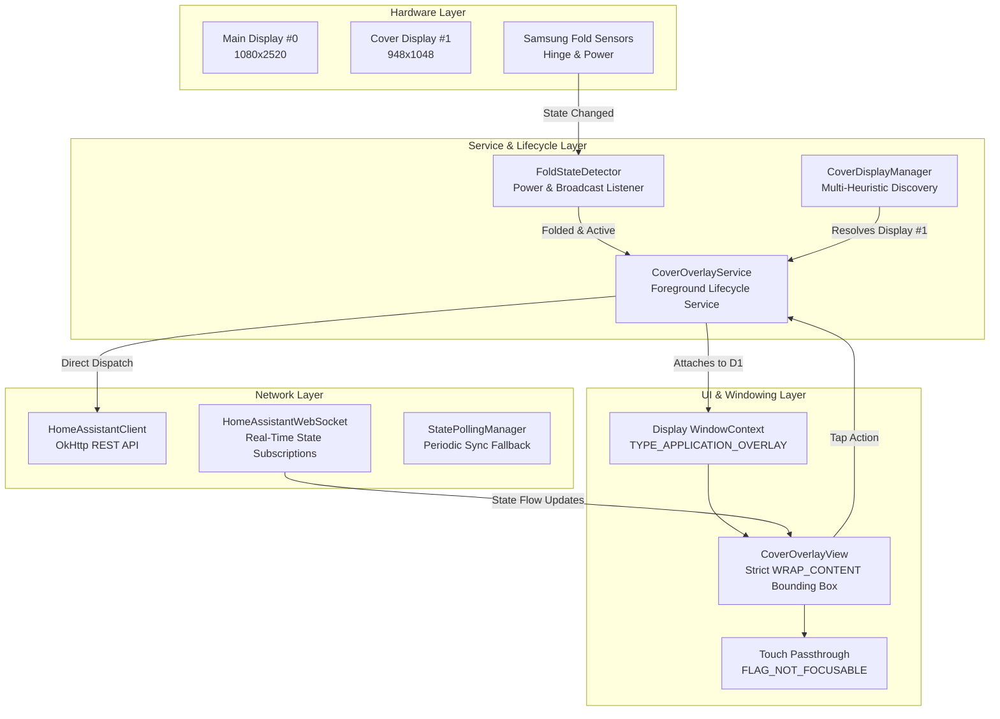
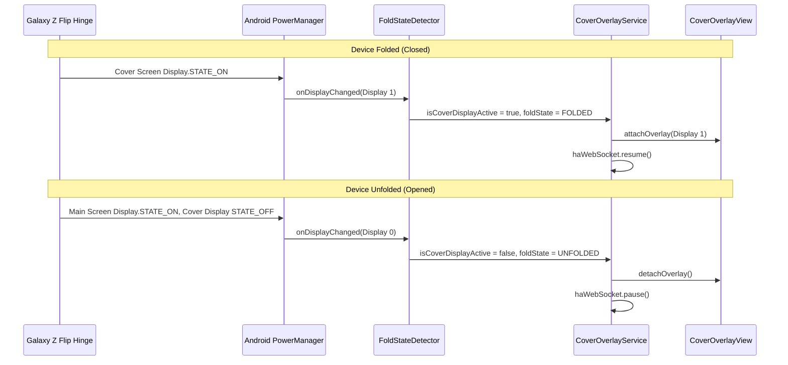

# Architecture & Technical Design

**Cover HA Overlay** is engineered specifically for foldable Android devices (Samsung Galaxy Z Flip / Fold) to provide zero-latency Home Assistant quick controls directly on the outer cover display.

---

## 1. System Overview



---

## 2. Multi-Display Window Targeting

### A. Samsung Outer Display Discovery
On Samsung One UI, standard calls to `DisplayManager.getDisplays()` without flags often omit internal secondary presentation surfaces. Cover HA Overlay queries `displayManager.getDisplays(null)` and `displayManager.getDisplays(DisplayManager.DISPLAY_CATEGORY_PRESENTATION)`, then evaluates each candidate in order:

1. **Main screen immunity**: display #0 is rejected outright. The target resolver returns `null` rather than falling back to Display #0, so the overlay never obstructs the internal foldable display.
2. **External / remote rejection**: any display whose name matches `cast`, `chromecast`, `miracast`, `hdmi`, `displayport`, `wifi`, `wireless`, `overlay`, `virtual`, `simulated`, `remote`, `external`, `dex`, `smartview`, or which carries `FLAG_PRIVATE`, is rejected. Casting to a TV or plugging into DeX must never relocate a door-unlock button.
3. **Name matching**: `sub`, `cover`, `flip`, `flex`.
4. **Resolution signatures**:
   - **Galaxy Z Flip7**: 948 × 1048 (≈ 1.11 aspect ratio)
   - **Galaxy Z Flip5 / Flip6**: 720 × 748 (≈ 1.04 aspect ratio)
   - **Galaxy Z Flip3 / Flip4**: 260 × 512 (≈ 1.97 aspect ratio)

There is deliberately **no catch-all**. An earlier version ended with "if there are two or more displays, this one is the cover screen", and separately accepted anything carrying `FLAG_PRESENTATION` — which is exactly the flag external displays carry. Unrecognised hardware now matches nothing, and the user pins the display explicitly via `TargetDisplayMode.SPECIFIC_ID` in the Displays tab.

### B. Window Context Creation (API 31+)
```kotlin
val displayContext = context.createDisplayContext(coverDisplay)
val windowContext = displayContext.createWindowContext(
    WindowManager.LayoutParams.TYPE_APPLICATION_OVERLAY, 
    null
)
val windowManager = windowContext.getSystemService(Context.WINDOW_SERVICE) as WindowManager
```

---

## 3. Fold State & Power Lifecycle



---

## 4. Touch Passthrough & Non-Intrusive Bounding Box

Unlike full-screen overlay apps that capture the entire display touch surface:
- **`WRAP_CONTENT` Dimensions**: WindowManager bounds are strictly shrunk to the bounding rectangle of the floating pill.
- **Window Flags**:
  ```kotlin
  val flags = WindowManager.LayoutParams.FLAG_NOT_FOCUSABLE or
              WindowManager.LayoutParams.FLAG_NOT_TOUCH_MODAL or
              WindowManager.LayoutParams.FLAG_LAYOUT_NO_LIMITS or
              WindowManager.LayoutParams.FLAG_SHOW_WHEN_LOCKED
  ```
- **Result**: Swiping, tapping clock widgets, or interacting with native One UI cover notifications outside the button icons passes straight through with zero latency.

---

## 5. Security & Power Efficiency

1. **Android Keystore (AES-256-GCM)**: Access tokens and server configuration are encrypted using `EncryptedSharedPreferences` backed by Android Keystore keys. If Keystore initialisation fails the manager reports `isEncryptionActive = false` and the UI shows a warning banner rather than silently downgrading to plaintext.
2. **Network idle when the screen is off**: when the cover screen sleeps, the WebSocket is closed and polling coroutines are cancelled, so the app performs no network work and holds no wake locks of its own.
3. **Reconnect backoff**: WebSocket reconnects use exponential backoff (2 s → 5 min, with jitter) and stop entirely on `auth_invalid` until the credentials change — an expired token no longer means a reconnect every five seconds forever.
4. **Watchdog cost, stated honestly**: `WatchdogReceiver` schedules a 15-minute `ELAPSED_REALTIME_WAKEUP` alarm via `setAndAllowWhileIdle` specifically to punch through Doze and survive One UI's process management. That is a real, if small, periodic wakeup — the app is not at zero idle cost, and claiming otherwise would be wrong.
5. **Polling shape**: the fallback poller issues a single `GET /api/states` per interval and filters client-side, rather than one request per tracked entity.
