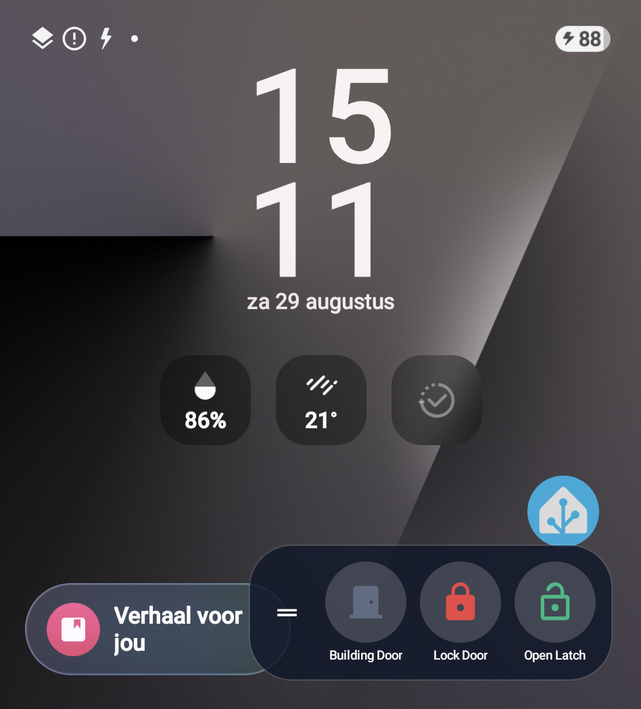

# Cover Screen Home Assistant Quick-Control Overlay

[](https://github.com/your-username/cover-ha-overlay/actions)
[](LICENSE)
[](fdroid_recipe/)
[-orange.svg)](https://developer.android.com)

A lightweight, security-hardened, zero-latency native Android application engineered specifically for **Samsung Galaxy Z Flip** foldable devices (**Galaxy Z Flip7, Flip6, Flip5, Flip4, Flip3**).

The app renders an always-available, floating quick-control bar of icon-buttons directly on the Samsung Cover Display (Flex Window / Sub-display). Tapping an icon executes Home Assistant entity/service actions instantly in the background with zero visible UI disruption, zero Activity launches, and full touch-passthrough to the native clock, notifications, and Samsung widgets underneath.

---

## 📸 Live on Samsung Galaxy Z Flip7

<div align="center">
  
  <p><em>Instant Home Assistant action buttons rendered directly on the locked Galaxy Z Flip7 cover screen.</em></p>
</div>

---

## ⚡ Why Cover HA Overlay vs Good Lock / MultiStar?

| Feature | Good Lock / MultiStar + HA App | Cover HA Overlay |
| :--- | :--- | :--- |
| **Launch Speed** | ❌ 2–4 seconds (swiping widgets, cold-starting WebView) | ✅ **0 milliseconds (instant on cover screen wake)** |
| **Lock Screen Access** | ❌ Requires device unlock to view full dashboard | ✅ **Works on locked cover screen** (`FLAG_SHOW_WHEN_LOCKED`) |
| **UI Interruption** | ❌ Takes over entire display with full app window | ✅ **Compact floating pill; zero full-screen popups** |
| **Touch Passthrough** | ❌ Captures entire screen | ✅ **Full touch passthrough to clock and Samsung widgets** |
| **Safety Guards** | ❌ Standard tap immediately fires | ✅ **Sensor guards (e.g. hallway light) & double-tap confirmations** |
| **Idle Battery Drain** | ⚠️ Background WebView memory footprint | ✅ **0.0% CPU when cover screen is asleep** |

---

## 🌟 Key Architecture & Features

- **Non-Intrusive Overlay (`TYPE_APPLICATION_OVERLAY`)**:
  - Rendered strictly to the bounding box of the button cluster (`WRAP_CONTENT`), never taking over the full display.
  - Window flags `FLAG_NOT_FOCUSABLE` and `FLAG_NOT_TOUCH_MODAL` ensure all touches outside the buttons pass directly through to Samsung's native cover widgets and clock.
- **Dynamic Display Targeting**:
  - Scans `DisplayManager.getDisplays()` dynamically at runtime to identify the cover screen using multi-heuristic detection (display name matching, aspect ratio analysis, and secondary display flags).
  - Attaches overlay to the cover display context via `createDisplayContext()`.
  - Graceful fallback for standard screens and emulators.
- **Fold-State Awareness**:
  - Automatically attaches the overlay when the phone is closed (folded) and cover screen is active.
  - Detaches cleanly when the phone is unfolded or when the cover display enters deep sleep.
- **Instant Background Actions**:
  - Service calls (`POST /api/services/<domain>/<service>`) fire asynchronously via OkHttp/Coroutines in background context.
  - Visual feedback on tap: Loading spinner, success animation, and error badge without opening any popups.
  - Built-in tap debounce preventing accidental multi-triggers.
- **Live State Sync**:
  - Real-time entity state synchronization over Home Assistant WebSocket API (`/api/websocket`).
  - Battery-aware lifecycle: Pauses WebSocket subscriptions when the cover screen sleeps, resuming on wake.
  - Fallback periodic polling for low-power operation.
- **Encrypted Local Storage**:
  - Base URL, Long-Lived Access Tokens, and button configurations are securely stored using Android Keystore `EncryptedSharedPreferences` (AES256-GCM).
- **Samsung One UI Background Longevity**:
  - Foreground Service with `specialUse` / `dataSync` type and persistent silent notification.
  - Boot receiver (`ACTION_BOOT_COMPLETED`, `ACTION_MY_PACKAGE_REPLACED`) and AlarmManager watchdog to survive One UI background process management.
- **Material 3 Setup Dashboard**:
  - Entity browser (fetches live entities directly from your HA server).
  - Service selector with smart presets per domain (`light.toggle`, `switch.toggle`, `cover.open_cover`, `lock.unlock`, `scene.turn_on`, etc.).
  - Built-in vector icon catalog and custom color palette.
  - Interactive Dock position selector (Top-Left, Top-Right, Bottom-Left, Bottom-Right, Custom drag).
  - Live "Display Inspector" and "Preview Overlay Now" testing tools.

---

## 📋 Required Permissions

| Permission | System Name | Why It Is Needed | How to Grant |
| :--- | :--- | :--- | :--- |
| **Draw Over Apps** | `SYSTEM_ALERT_WINDOW` | Renders floating quick-control bar on cover screen | In-app button routes to `Settings > Appear on top` |
| **Unrestricted Battery** | `REQUEST_IGNORE_BATTERY_OPTIMIZATIONS` | Prevents One UI from killing the background service | In-app button routes to Battery Exemption prompt |
| **Notifications** | `POST_NOTIFICATIONS` | Displays required foreground service status notification | System dialog prompt on Android 13+ |
| **Internet** | `INTERNET` | Communicates with Home Assistant REST & WebSocket API | Granted automatically |
| **Boot Completed** | `RECEIVE_BOOT_COMPLETED` | Restarts overlay service after phone reboot | Granted automatically |

---

## 🚀 Setup & Installation Guide

### Step 1: Generate Home Assistant Long-Lived Access Token
1. Open your **Home Assistant** web interface.
2. Click on your **User Profile** (bottom-left corner).
3. Scroll down to the **Long-Lived Access Tokens** section.
4. Click **Create Token**, give it a name (e.g. `Z Flip Cover Overlay`), and copy the generated token string.

### Step 2: Build & Sideload Debug APK
Ensure you have the Android SDK and ADB installed:

```bash
# Build the debug APK
./gradlew assembleDebug

# Install onto your Samsung Galaxy Z Flip via USB or Wireless ADB
adb install -r app/build/outputs/apk/debug/app-debug.apk
```

### Step 3: Initial App Configuration
1. Open **Cover HA Overlay** on your phone's main screen.
2. In the **System Permissions** card, tap **Grant** for **Draw Over Other Apps** and **Unrestricted Battery**.
3. In the **Home Assistant Setup** card:
   - Enter your **Server URL** (e.g. `http://192.168.1.50:8123` or your Nabu Casa remote URL `https://xxxx.ui.nabu.casa`).
   - Paste your **Long-Lived Access Token**.
   - Tap **Test Connection** to verify communication.
   - Tap **Save Credentials**.
4. Switch to the **Buttons** tab to customize your quick-control icons:
   - Tap **+ Add Button**.
   - Tap the search icon next to *Entity ID* to search your live Home Assistant entities.
   - Select your desired icon, friendly label, and accent color.
   - Tap **Save Button**.
5. Switch to the **Layout** tab to adjust dock position (e.g. *Bottom Right* or *Top Center*), icon size, and background opacity.
6. Verify the **Overlay Service** switch is ON.
7. Close your Galaxy Z Flip phone — your quick-control overlay is now live on the cover display!

---

## 📱 Samsung One UI Specific Recommendations

Samsung One UI employs aggressive battery management. To ensure 100% reliability over days of idle time:

1. **Set Battery to Unrestricted**:
   - Go to `Settings > Apps > Cover HA Overlay > Battery > Select "Unrestricted"`.
2. **Add to Never Sleeping Apps**:
   - Go to `Settings > Battery > Background usage limits > Never sleeping apps > Tap '+' and add Cover HA Overlay`.
3. **Lock App in Recents (Optional)**:
   - Open App Switcher / Recents, tap the **Cover HA Overlay** app icon, and select **Keep open / Lock this app**.

---

## 🧪 Testing & Verification Tools

- **Overlay Preview Mode**: Tap the **Eye** icon in the top app bar to immediately render the overlay on your active display without needing to fold the device.
- **Display Inspector Tab**: Inspect all attached displays (`DisplayManager.getDisplays()`), verifying display IDs, resolutions, flags, and cover detection heuristics.
- **Mock Unit Tests**: Run `./gradlew testDebugUnitTest` to execute all unit tests against models, display heuristics, and MockWebServer.

---

## 🛠️ Tech Stack & Dependencies

- **Language**: Kotlin 2.0.21
- **UI Framework**: Jetpack Compose with Material 3
- **Network**: OkHttp 4.12, Gson, Coroutines & Flows
- **Security**: Jetpack Security Crypto (`EncryptedSharedPreferences`, MasterKey AES256-GCM)
- **Target SDK**: Android 14 (API 34)
- **Tested Target Hardware**: Samsung Galaxy Z Flip7, Flip6, Flip5 (One UI 6.x / 7.x)

---

## ⚖️ Disclaimer & Safety Warning

> [!IMPORTANT]
> **Use at your own risk.** This application communicates directly with your Home Assistant instance and can trigger physical automations (such as unlatching front doors, opening garages, or switching appliances). The authors and contributors assume **no responsibility or liability** for any damages, security incidents, unintended actions, or hardware malfunctions resulting from the use or misuse of this software. Always test smart lock configurations and safety guards thoroughly before relying on them.

---

## 📄 License

This project is licensed under the **MIT License** — see the [LICENSE](LICENSE) file for details. Anyone is free to use, modify, distribute, fork, and build upon this code.
